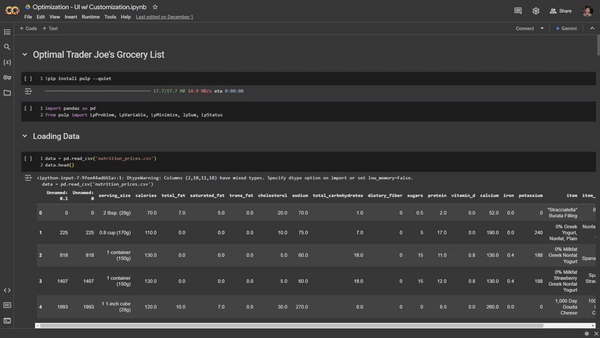

Running the Streamlit App:

1. Open model.ipynb in colab
2. Upload `cleaned_data_latest.csv` into colab (found in data folder)
3. Run the last three cells, found under the INTERACTIVE UI heading 
4. Click the link in the last cell, and use the IP address printed by the last cell as password

The App should be running. Reload if error, will take ~1 min to initialize. Model takes ~1m to run, so please be patient!
